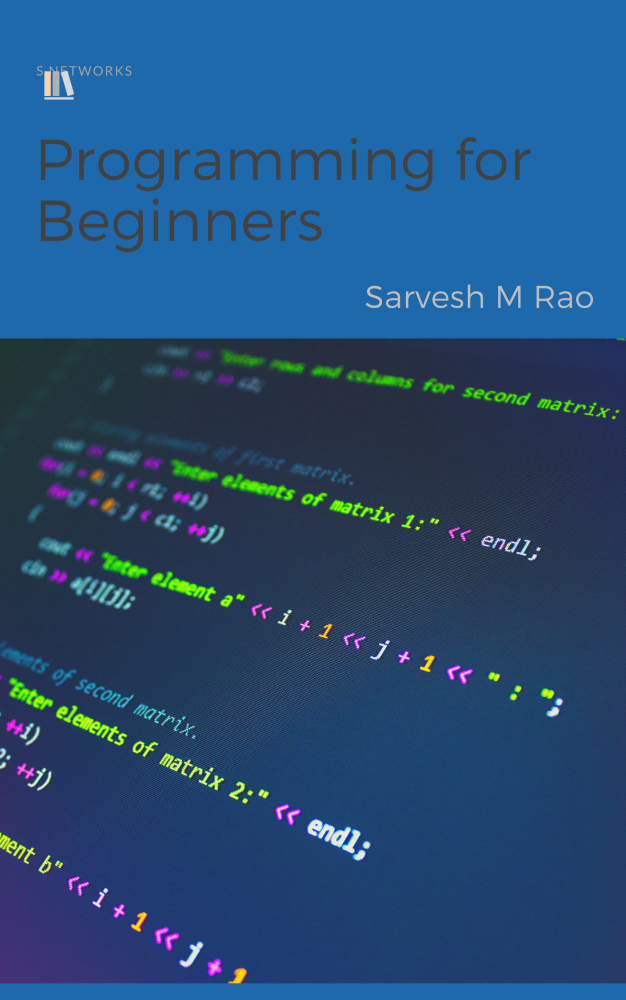

# Programming For Beginners

[What exactly is programming?](#h.qripscf3vevn)

[What are the programming languages?](#h.coxk854iofjj)

[How programming languages are made?](#h.8t82l2hr0kb6)

[Why learn Python?](#h.w1y22vcvgnk9)

[Your first program](#h.f5n95ap7ltqg)

[Code your own calculator](#h.uveg6pmwduwl)

[Operations in Python](#h.d9xac6lw32v)

[Subtraction -](#h.l12es1k8fy53)

[Multiplication *](#h.ejlhlhbq3797)

[Division /](#h.8f0oxevrqm56)

[Modulus %](#h.vrti4ua68n9v)

[Types In Python](#h.3qznduq94whm)

[Integers](#h.hyqa738mqwvc)

[Strings](#h.k9ov8f6xajln)

[Float](#h.uzmszy60zmp)

[Boolean](#h.xu5tzzre084n)

[Casting](#h.lqes8aemgm6w)

[Joining strings in python](#h.73ocdmn676w6)

[Adding strings with numbers](#h.21qthlp0uy1p)

[Control flow in Python](#h.k7wd8ow5n00)

[Conditions in Python](#h.d2ptz82d61ov)

[Basic syntax:](#h.5z19ygtz4rf9)

[While loop in Python](#h.f66cszjv3d1i)

[While loop syntax](#h.qlbeg5krlagd)

[For loops in Python](#h.4th6jfks6htj)

[For loop with a range syntax.](#h.yds32k6elko2)

[Lists in Python](#h.nnq98alizbg9)

[Dictionaries in Python](#h.2xt50eq8g3xj)

[Adding new data](#h.uezwmxp9i0qk)

[Removing Items](#h.epyjwqa9a1de)

[Functions in Python](#h.n92smpjowtun)

[Functions](#h.c26fmyv7u0)

[What Next?](#h.mwficmuudv0b)

# 

# What exactly is programming?

Is it just full of mathematical equations and 0’s and 1’s?

Or is it just all about some alien language typed really fast on a keyboard?

Well in reality

It’s just a step by step instructions

Given to a computer to get from input to output

How we get from that one point to the other is This black box or set of instructions.

And the funny thing is that: this black box can be: A circle A triangle or any other shape you mould it to be.

# What are the programming languages?

Java, Python,C,C++,C#,Kotlin,Dart,Javascript..

You can name them. But what exactly are these?

A computer or any electronic device can understand only machine language.

That is ON and OFF or 1’s and 0’s or True or False or simply to say whether current flows or not.

So, a programming language in simple terms is just a tool used by us to communicate with computers.

Programming syntax is a set of grammatical rules that a programmer has to follow for that particular programming language. A man-eating tiger was caught. A man-eating tiger was caught.

## How programming languages are made?

They stand upon the shoulders of giants.

High-Level Languages

^

Assembly Language

^

Machine Language

^

Hardware

# Why learn Python?

Well because python is Beginner-friendly

That is easy to write, read and use.

And also learn faster

Different paths to choose from

Data science

Machine learning

Web development and so on...

The vast amount of resources tools and a very huge community

And much more in this series you'll be learning Python. Make your own project A website

Your own Jarvis and much much more.

# 

# 

# 

# 

# 

# 

# Your first program

Let's write our first line of code in Python Open the IDE

---- EXPLAIN IDE HERE----

<table class="c27">

<tbody>

<tr class="c28">

<td class="c35" colspan="1" rowspan="1">

`name=input()`  
`print("Hi", name)`

</td>

</tr>

</tbody>

</table>

I'll explain this in a sec

Run

Enter your name

Congrats! You ran your first line of code!

Now for the explanation

Here name is something that we call a variable. I like to think of variables as empty boxes that can hold some value.

`name=input()`

`input()` is a function (on that later)

What it does is wait for the user to give some input in the form of text. In the last slide, I entered SMR which was then stored as text in the variable (imagine as a box) ‘name’.

This is easier than the last one

`print()` is the function like `input()`. Inside the brackets ‘()’ we specify what we want to show as an output on the screen.

`print("Hi", name)`

In Python code, text that needs to be stored or printed or displayed should always be inside “double quotes like this”.

 Then we add a comma and write the ‘name’ variable which contains what we imputed earlier- “SMR”.

# Code your own calculator

Let’s code our own calculator in Python. Open Python IDE

Type the code below in the editor

<table class="c27">

<tbody>

<tr class="c28">

<td class="c35" colspan="1" rowspan="1">

`calculate = input(">>>")  
print(eval(calculate))

</td>

</tr>

</tbody>

</table>

Click run Type 9 + 57 or any other numbers and press enter

Now let's break down what we just did.

`calculate = input(">>>")

On line 1 we declare a variable called calculate. As I told in the previous chapter, variables are what we use to put data or information in Python.

input() is something that we use to get input from the user. The text inside the (), here “>>>”. Will be shown just before where the user types (the questions).

Don’t panic, you’ll get this in a second!

print(eval(calculate))

Just like math, Python gives priority to (brackets) first.

So what will have the most priority?

-Calculate (more)

--eval

---print (less)

Here, calculate stores the mathematical expression as a string (text). This expression is simply what needs to be calculated or run. Here: 9 + 57

eval() is a simple function that executes Python code. This means 9+57 is executed in Python and returns a value of 66.

print(eval(calculate))

|        |        |     “9 +57”  |   |  |

|        |        ----------------------------   |  |

|        |        66                    |  |

|        ----------------------------------------------- |

|        Outputs 66 on-screen   |

-------------------------------------------------------------------

That’s it!

In the next chapter, we will learn more about multiplication, division and many other things we can do with this calculator!

# Operations in Python

In the last chapter, we made a calculator using Python. Let’s try doing some basic math operations.

Last chapters code

calculate = input(">>>")  
print(eval(calculate))

Last chapter we had done addition. Now let’s try some other operations.

## Subtraction -

Run the same code Type 200-8 and hit enter

## Multiplication *

For multiplication, we use *(asterisk) arithmetic operator ( +, -, * are also arithmetic operators in python

Type 8*9 ad hit enter

## Division /

For division, we use forward slash between the numbers

Notice how the result is 4.0 and not just 4

We will discuss this in a later chapter

## Modulus %

This is a special operator found in programming languages that divides two numbers and returns the remainder.

Let’s test what we have learned

Recall from the last chapter that what's within a bracket (parentheses) is given more priority first.

DIY Challenge

Write a program

Make a variable called numberOfPens (don’t leave space between variable names) and assign it a value of 25\.

Then make another variable called cost (cost of a pen) of value 5.

Print out the total cost on the screen.

Hint: You can use variable names just as you would with numbers. Eg print(x+y)

# Types In Python

Every programming language has data types.

These define the type of data that is stored.

What we’ll learn Integer String Float Boolean

IDE BRO!!!

## Integers

Just like math, integers include both negative and whole numbers.

x=90

This is how you store integers in a variable.

In python, you don’t need to specify variable type during declaration like you do in other languages like C and Java.

## Strings

Strings are used to store data as text.

text = “ Stay Home Stay Safe”

Strings should always be enclosed within either single or double-quotes. You can store it on multiple lines by enclosing between three single or double-quotes.

text = ””” This is a multi-line text”””

## Float

Floats are just a fancy way of calling a number with a fractional value.

y= 24.3

print(type(y))

To make a float, you simply add a decimal point after the whole number value.

The second line will print the type of data, variable y is holding. Here, a float

<class ‘float’>

## Boolean

When you want to store something that can have only two possible values, like yes or no you can use booleans.

programmingIsFun = True

Booleans can be either True or False (notice the caps).

We will work with booleans in another chapter.

## Casting

If you want to change the type of data, like integer to string, you can use the casting feature in python.

X = str(5)

print(type(x))

Str is short for the string. When you run this code, you will find that x is of type string and not an integer.

String str()

Integer int()

Float float()

Boolean bool()

# Joining strings in python

Concatenation or adding strings together

Adding two strings

Text = “Hi, I am “

name = “SMR”

print(text + name)

Use the IDE for testing

You can easily add two strings in Python and use the print function on them.

Notice the space I left between am and “. The same whitespace( ) is found while printing. ( Try removing it and run the code)

## Adding strings with numbers

Try running this code:

age = 24

print(“Age is “ + age)

Don’t panic this would get an error message. This time, let us try to understand the error message. Understanding these are a crucial part of being a programmer.

Line2 this shows on which lie the error was found

Type error…..

We can see that there was a TypeError (when you use the correct data types in an operation) - you cannot add an integer under string in Python.

But you can change an integer into a string, and then add them. (Concatenate)

Any idea on how to do this?

Try taking this as a challenge. Try to solve it yourself. You may refer to the last chapter for help on casting.

Answer

age = 24

print(" Age is " + str(age))

You can do the same with floats. Also, try casting a Boolean into an integer.

That's it, for now, one step closer to being a master programmer.

# Control flow in Python

Control flow is an important programming concept.

It is one that makes programming special.

But what is a control flow?

Control flow determines the order in which each line of code is run. To achieve this we utilise conditions, loops, and function calls.

First, let's start with conditions.

Hungry?

No (false)

Yes (true)

Let's code

Eat food

This is a simple abstraction of how we use conditions in real life.

Using something similar, we can control how some code is run - the order in which it is executed or run.

So the next question will be:

How can we apply this in programming?

And that's exactly what will be dealing in the next chapter:  control flow with conditions

# 

# 

# Conditions in Python

Extra to implement the hungry flow chart from the last chapter.

This is the flowchart we dealt with yesterday. Let's try to implement this in our code.

First, we need to figure out how to implement the yes or no feature.  but how?

Recall that there is a data type called Boolean, which can have two possible values - true and false. This with exactly our need.

Now how are you going to check if something is true or false, and then execute the specific program for that specific situation?

For that will introduce conditional statements.

If, else and elif (else if)

### Basic syntax:

if somethingIsTrue:

   Execute this part of code

elif SomethingElseIsTrue:

   Execute this

else:

   Execute this

Now, let's implement the flowchart in code.

hungry=true()

if hungry:

   print("Eat Food")

else:

   print("Let's Code")

You can change hungry's value to false. I am hungry so.

Let's break it down!

We set hungry to true

Check if the condition is satisfied.

If satisfied execute the below code.

Notice the white space here?

It is used to tell Python that whatever comes after the above line with such white space and: should be executed ( if condition satisfied).

This whitespace is called an indentation. Which is usually 4 spaces or tab, use the tab key to create 4 spaces like this.

If the, if statement is not satisfied to execute this not, is the indentation.

# While loop in Python

Looks are very useful for running code multiple times without rewriting

Basic while loop structure

Start -> Checks if condition is satisfied

True -> Do something return to start

False-> Exit loop

Now with this structure in mind, how can we repeat something n times?

Let's try to do something five times

Start

Create a variable called counter and set it to 0 initially.

->

Check if counter is less than 5

True -> do something and increase the counter by 1

False-> exit loop

In the first cycle from check back to check counter equal to zero in the next cycle it will become one

the value will increase till 5 before exiting the loop because at the cheque lekin entrance we can check whether the counter is less than 5

if not win counter is equal to 5 we will stop implementing that is increasing the countess value and exit the loop

### While loop syntax

while condition:

   Do something

Let's code it

counter=0

Set counter equal to zero at start

while condition < 5: --- this is a conditional expression. More on that later. What it basically does is return true or false depending on the expression.

Eg. 2 > 1 is the same as true and 3 < 5 is the same as false.

Here in the first cycle it would be 0 < 5 which is the same as true.

   print(counter) -- Prints the value of counter in each cycle.

counter = counter + 1 --- this might look a bit weird at first if you look at like math. but what it does is return the value of the counter increased by 1 and store in the counter variable itself.

print("done") --- after the loop is done this line is executed. Notice that the indentation separates this line from the while loop.

# For loops in Python

In this chapter we will try to implement the same thing as last, but using a for loop

### For loop with a range syntax.

for i in range(5):

   Do something

This does exactly what we did last time with a while loop.

Let's break it down..

In each cycle, the value of i changes to the number below the cycle number.

We start a for loop with a keyword called for.

We start a for loop with a keyword called for. The i here is called an iterator ( you can name it anything). The range(5) does the i=i+1 (counter in the last chapter). Just like the last time, the value of i will be 0 in the first cycle and go till 5 (0,1,2,3,4) without including 5\.

for i in range(5):

   print(i)

print(“Done”)

I hope there’s no need of further explanation for this. What this will do is print 0-4 on separate lines and then print Done.

You can use i just as a variable, but only within the for loop (intended part after : till end of information)

Challenge

In this challenge you will have to use for loop to print steps made of # like:

#

##

###

####

You should take an integer input by int(input()) since input() takes a string as input by default. Use that as a hint to make a program that will print steps dof height n units. Eg: Above is steps of 4 unit height. Use “#” * 3 to print ###

# Lists in Python

Before we jump into the rest of control flow, let’s learn about lists and some other data types that are very useful.

Suppose that you want to store the names of animals in a mini zoo. How will you do that?

You could create a variable and store names of each separately.

animal1 = “Lion”

animal2 = “Giraffe”

animal3 = “Elephant”

But this would be insufficient and hard to manage if we had 1000’s of animals.

This is where lists come in. You can do the same thing now in

animals= [‘Lion’, ’Giraffe’, ’Elephant’]

A single Line! Yes

To create a list just use two square brackets like a=[]

A single list in python can store data of all types.

a= [ 5, ‘a string’, True, 10.4]

Accessing values in List with index

You can access data in list by their index number eg: listname[index]

animals= [‘Lion’, ’Giraffe’, ’Elephant’]

print(animals[0])

Output: Lion

Because programmers start counting from 0

animals= [‘Lion’, ’Giraffe’, ’Elephant’]

print(animals[-1])

Output: Elephant

You can also count in reverse

Adding items to a list

Add items to the end of list using listname.append(data)

animals= [‘Lion’, ’Giraffe’, ’Elephant’]

animals.append(‘Zebra’)

print(animals)

Output: [‘Lion’, ’Giraffe’, ’Elephant’, ‘Zebra’]

Removing items from lists

Remove the last item from list using listname.pop() or specify the item’s index by listname.pop(index)

animals= [‘Lion’, ’Giraffe’, ’Elephant’]

animals.pop()

animals.pop(0)

print(animals)

There are much more things that you can do with Python. But these are enough for us as beginners.

# Dictionaries in Python

Just like lists, dictionaries are another useful data structure.

Suppose you want to store the name and age of animals in a mini zoo.

You could do like :

lion=5

elephant=6

giraffe=3

turtle=50

But again, this is inconvenient when we have dictionaries.

With dictionaries the same thing can be written as

animalAges = {‘lion’:5, ‘elephant’:6}

                Key         Value

Writing full would take more space

Basic syntax:

dictionaryName= {key1:value1, keyN:ValueN}

Multiple lines are allowed

We can understand that dictionaries use key-value pairs .

Keys are just like the keys you will use to open a safe and retrieve the data in it.

Retrieving data from dictionaries

animalAges = {‘lion’:5, ‘elephant’:6}

print(animalAges[‘lion’])

Output: 5

We first specify the dictionary name and then use square brackets within which the key goes in. eg: dictName[key]

Keys and values can be anything: string,int,float even booleans!

### Adding new data

Use syntax: dictionary[newKey] = value

animalAges = {‘lion’:5, ‘elephant’:6}

animalAges[‘cat’] = 2

print(animalAges[‘cat’])

Output: 2

### Removing Items

Use syntax: dictionary.pop(key)

animalAges = {‘lion’:5, ‘elephant’:6}

animalAges.pop(‘lion’)

print(animalAges)

Output: {‘elephant’: 6}

# Functions in Python

Functions play an important role in every programming language.

Suppose you want to perform a task over some data in a particular part of code.

And now you want to repeat it again somewhere else.

Repeating the same lines of code would be considered a bad practice because of DRY ( Don’t Repeat Yourself)

This is where functions come in!

### Functions

You can think of an entire program as a factory

Then the functions would be the machines used.

Without machines it would be like making a separate machine each time for the same task.

def machineName():

   Tasks this machine can do

def keyword is used to define a function.

Then we specify the function name and open brackets followed by a colon

Let's code something

def welcome(name):

    print(“Welcome”, name)

welcome(“SMR”)

On the first two lines, we create the function and specify what it does.It takes an argument (name) which is a raw material given to a machine to get a product.

The last line welcome(“SMR”) we call the function just like running a machine. The raw material (argument) here is “SMR” as string.

Finally it prints a welcome message.

Challenge

Make a simple function that prints the double of any number you give as an argument. Eg: 8 is an argument. Output: 16

Call the function whatever you want

# What Next?

By now, I hope all of you have a basic understanding of programming in Python.

Building a base knowledge and strengthening it is always important.

First, I want you to search in Google for w3-schools Python. W3schools is an awesome website for referring from.

On the website, by the left, you will find all the topics that we have covered +more.

Go through each topic we have talked about and do all the simple exercises in it.

That’s it!

 

